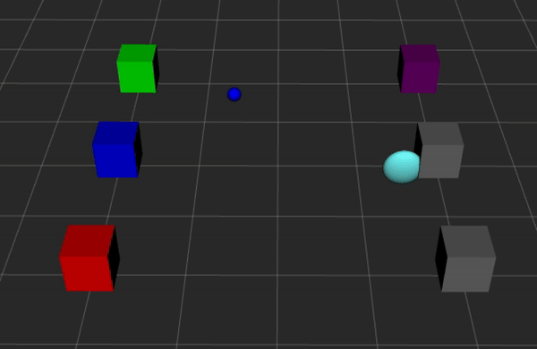

# PostBot🤖 - Delivery is on its way!
---

## What is PostBot?🤖

**PostBot** is an autonomous postman-robot, simulated by **Turtlesim**, that collects colored marbles and has to deliver them in boxes according to the same color.  

**RViz** is utilized for providing a real-time visual representation of the simulation. It displays the robot, marbles, boxes, and the environment grid, offering users a comprehensive view of the robot's interactions within the simulated space.  

The simulated world spawns marbles in different points of the map at every cycle, and this position is communicated to the bot through personalized messages. Once the message arrives, the bot goes to the communicated marble position to "collect" it and delivers to the color-corresponding box. When all the boxes are full, the system resets the world by emptying the boxes and spawning new marbles in new position. The bot is now ready for new deliveries!


<div align="center">
  
  
  
</div>

---

## Requirements👾

- **Operating System:** Ubuntu 20.04
- **ROS Distribution:** ROS Noetic Ninjemys
- **Dependencies:**
  - `turtlesim`
  - `rviz`
  - `ros-<distro>-visualization-msgs`
  - `ros-<distro>-geometry-msgs`
  - `ros-<distro>-std-msgs`
  - `ros-<distro>-message-generation`
  - `ros-<distro>-message-runtime`

---

## Core Components🕹️
A rapid overview of core components that PostBot uses:

### Nodes
- **Initialization Node** (`init_system.py`): Initializes the system by loading parameters and setting up necessary publishers and subscribers.
- **Managing Deliveries** (`managing_boxes.py`): For managing deliveries by communicating the Box Goal.
- **Spawning Marble** (`spawn_marble.py`): For managing the position of the newly-spawned marble and to communicate its position.
- **Navigation Node** (`navigation_node.py`): Receive the delivery goal and plans the path the TurteSim has to follow.. Once it arrives to destination it updates the box status. Subscribes to `/turtle1/pose` to receive the robot's current pose and publishes to `/turtle1/cmd_vel` to control movement.

### Topics

- **Custom Topics**
  - **`/current_marble`**
    - **Type:** `MarbleInfo`
    - **Description:** Publishes information about the current target marble, including its color and position. The `navigation_node` subscribes to this topic to determine the next destination for the robot.

  - **`/robot_marker`**
    - **Type:** `visualization_msgs/Marker`
    - **Description:** Publishes a marker representing the robot's position and state in RViz. This allows for visual tracking and status indication within the simulation environment.

  - **`/box_marker`**
    - **Type:** `visualization_msgs/MarkerArray`
    - **Description:** Publishes markers representing the boxes in the environment. Each box is visualized as a separate marker in RViz, displaying its color and occupancy status.

  - **`/box_status`**
    - **Type:** `BoxInfo`
    - **Description:** Publishes the status of each box, including its color, position, and whether it is currently occupied. This information is used by nodes to manage interactions with boxes.

- **Built-In Topics**
    - **`/turtle1/pose`**
      - **Type:** `turtlesim/Pose`
      - **Description:** Publishes the current pose (position and orientation) of the turtle. The `navigation_node` subscribes to this topic to receive real-time updates of the robot's location.
  
    - **`/turtle1/cmd_vel`**
      - **Type:** `geometry_msgs/Twist`
      - **Description:** Accepts velocity commands to control the movement of the turtle. The `navigation_node` publishes to this topic to drive the robot towards targets.
  

### Custom Messages
- **Custom Messages:**
  - `BoxInfo.msg`:
    ```msg
    string[] colors
    float32[] x
    float32[] y
    int32[] status
    ```
  - `MarbleInfo.msg`:
    ```msg
    string color
    float32 x
    float32 y
    ```

- **Standard Messages:**
  - `geometry_msgs/Pose`: Represents the position and orientation of the robot.
  - `geometry_msgs/Twist`: Represents velocity commands.
  - `visualization_msgs/Marker`: Used for visualizing objects in RViz.


### Services
- **Custom Services:**
  - `reset_boxes.srv`:
    ```srv
    ---
    bool done
    ```

- **Built-in Services:**
  - `/turtle1/set_pose`: Sets the robot's pose in Turtlesim.

  
### Parameters
- **Configuration File (`robot_par.yml`):**
  ```yaml
  robot_initial_pose:
    x: 4.0
    y: 1.0
---

## How PostBot Works?🖲️
  - The `init_system.py` node loads the parameters from the `robot_par.yml` file needed for positioning the robot.
  - After loading the parameters, `init_system.py` publishes visualization markers for both the robot and the boxes to RViz. These markers provide a graphical representation of the robot's starting point and the positions of the boxes.
  - The `spawn_marble.py` node manages the spawn of marbles within the simulation. They spawn at random positions within the environment and serve as targets for the robot to collect and deliver to the designated boxes.
  - The `navigation_node.py` node controls the robot's movement. It subscribes to the `/turtle1/pose` topic to receive real-time updates about the robot's current position and orientation and listens to the `/current_marble` topic to obtain information about the marble that the robot should target next.
  - The path to the marble then it's calculated and publishes velocity commands to the `/turtle1/cmd_vel` topic, directing the robot towards the marble.
  - As the robot moves, the node also updates the robot's marker in RViz so that the movement is seen in the environment.
  - Upon reaching a marble, the robot "collects" it and the marble disappear.
  - The robot then navigate towards the corresponding box. Once it arrives at the box's location, the box is 'full' and then turns grey.
  - When all the boxes are grey, and so they are all full, the `reset_boxes` is called.
  - The `reset_boxes` service resets the status of all boxes, making them available for new marbles and so initiating a new cycle of deliveries!

---

## How To Install🎮
We assumes you are using **Ubuntu 20.04 (Focal Fossa)** with **ROS Noetic Ninjemys**. Ensure you have the necessary permissions to install software and modify system configurations.
If you haven't installed ROS Noetic yet, follow the official guide: [ROS Noetic Installation Guide](http://wiki.ros.org/noetic/Installation/Ubuntu).
We also presume **RViz** is installed correctly, if not please refer to the guide here: [RViz Installation Guide](http://wiki.ros.org/rviz/UserGuide).

  - **Create Catkin Workspace for managing ROS projects**
  ```bash
  mkdir -p ~/catkin_ws/src
  cd ~/catkin_ws/
  ```

  - **Clone the PostBot repository**
  ```bash
  cd ~/catkin_ws/src
  git clone https://github.com/ludovic4g/PostBot.git
  ```

  - **Initialize and source the Workspace**
  ```bash
  catkin_make
  source devel/setup.sh
  ```

  - **Setup Roscore**
   ```bash
  roscore
  ```

  - **Launch PostBot**
  ```bash
  roslaunch postbot system.launch
  ```
  
---

## License📝
  This project is licensed under the [MIT License](LICENSE).

---

## Collaborators🫂
  - **Ludovica Genovese** - [ludovic4g](https://github.com/ludovic4g)
  - **Manuel Sica**  - [manuelsica](https://github.com/manuelsica)


